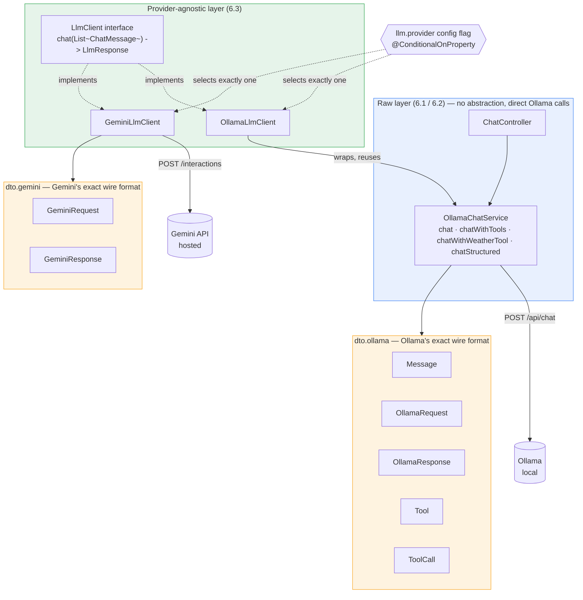
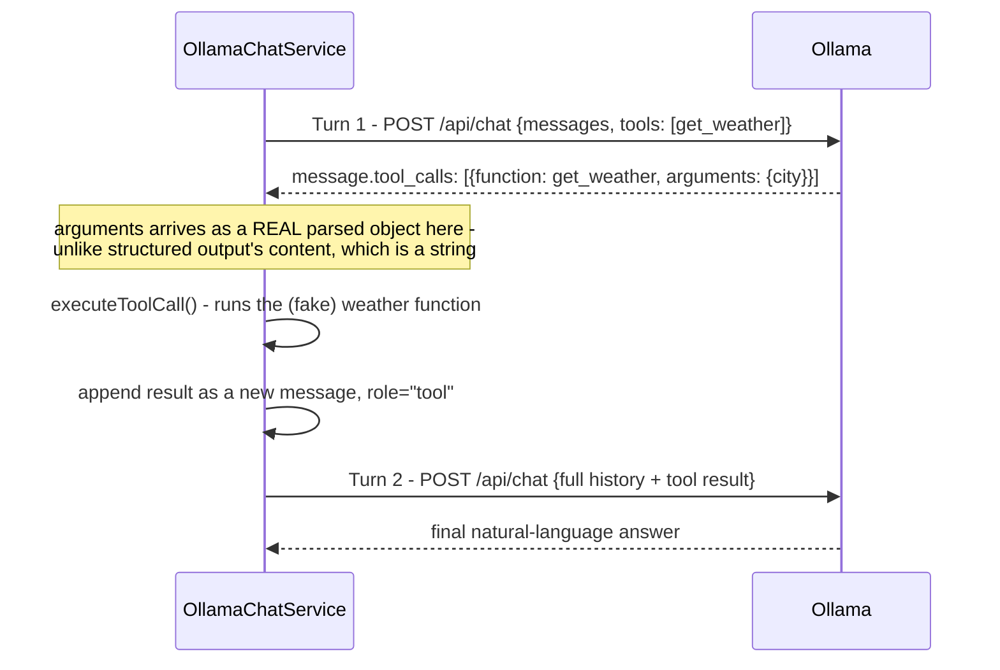

# Phase 6 Revision Guide — LLM API Fundamentals

**Purpose of this document:** come back here with zero memory of what was built and
leave understanding what Phase 6 is, why it exists, what was actually built, and be
able to test yourself against real interview questions. `ROADMAP.md` has the full
argument trail if you ever want it; this doesn't assume you'll go read that first.

---

## 1. The one-paragraph version

Phase 6 answers: **what does an LLM API actually do, mechanically, underneath a
framework like Spring AI?** Every piece of this phase was built as a raw, hand-written
HTTP call — no abstraction — specifically so the mechanics (multi-turn history,
real token accounting, structured output, tool-calling) were understood *before* any
framework's convenience could hide them. Only in the last milestone (6.3) did a real
abstraction (`LlmClient`) get introduced, and only once there were two real providers
(local Ollama, hosted Gemini) actually needing to switch between — never speculatively.

---

## 2. Why this matters (the production connection)

This is the foundation every LLM-backed feature in production sits on: how
conversation history actually gets sent (the model has no memory of its own — the
caller resends everything, every time), how token counts translate to cost and
context-window limits, how "the model returns JSON" really works (it's still just text
the caller must parse), and how tool-calling actually differs from a chat reply. Anyone
who's only ever used a framework's `@Tool` annotation or a chat SDK's `.send()` method
can't debug it when the abstraction leaks or explain in an interview what's really
happening — that's the gap this phase closes.

---

## 3. Architecture — what exists now

### The tool-calling round trip (Milestone 6.2's core mechanic)

---

## 4. Class-by-class reference

### Raw layer — Milestones 6.1 / 6.2

| Class | What it does | Link |
|---|---|---|
| `ChatController` | REST endpoints (`/chat`, `/extract-person`, `/chat/weather`) to manually trigger and inspect each mechanic via `curl` | [source](../llm-fundamentals/src/main/java/com/distributedplatform/llmfundamentals/controller/ChatController.java) |
| `OllamaChatService` | The raw mechanics: `chat`, `chatWithTools`, `chatWithWeatherTool`, `executeToolCall`, `chatStructured` | [source](../llm-fundamentals/src/main/java/com/distributedplatform/llmfundamentals/service/OllamaChatService.java) |
| `Message` / `OllamaRequest` / `OllamaResponse` / `Tool` / `ToolCall` | DTOs matching Ollama's exact real wire format, verified via `curl` before being written | [dir](../llm-fundamentals/src/main/java/com/distributedplatform/llmfundamentals/dto/ollama/) |
| `ExtractedPerson` | Target type for schema-constrained structured output | [source](../llm-fundamentals/src/main/java/com/distributedplatform/llmfundamentals/dto/ExtractedPerson.java) |
| `OllamaChatServiceTest` | Multi-turn history proof, real token counts, structured output | [source](../llm-fundamentals/src/test/java/com/distributedplatform/llmfundamentals/service/OllamaChatServiceTest.java) |
| `OllamaChatServiceToolDispatchTest` | Pure unit test — known-tool and unknown-tool dispatch branches, no Ollama | [source](../llm-fundamentals/src/test/java/com/distributedplatform/llmfundamentals/service/OllamaChatServiceToolDispatchTest.java) |
| `ChatControllerTest` | Full HTTP round trip via `TestRestTemplate` | [source](../llm-fundamentals/src/test/java/com/distributedplatform/llmfundamentals/controller/ChatControllerTest.java) |

### Provider-agnostic layer — Milestone 6.3

| Class | What it does | Link |
|---|---|---|
| `LlmClient` | The interface: one method, `chat(List<ChatMessage>) -> LlmResponse` | [source](../llm-fundamentals/src/main/java/com/distributedplatform/llmfundamentals/dto/LlmClient.java) |
| `ChatMessage` / `LlmResponse` | The shared, provider-agnostic DTOs | [message](../llm-fundamentals/src/main/java/com/distributedplatform/llmfundamentals/dto/ChatMessage.java) · [response](../llm-fundamentals/src/main/java/com/distributedplatform/llmfundamentals/dto/LlmResponse.java) |
| `OllamaLlmClient` | Adapter — wraps `OllamaChatService`, selected when `llm.provider=ollama` (or unset) | [source](../llm-fundamentals/src/main/java/com/distributedplatform/llmfundamentals/service/OllamaLlmClient.java) |
| `GeminiLlmClient` | Real second implementation against Google's hosted Interactions API, selected when `llm.provider=gemini` | [source](../llm-fundamentals/src/main/java/com/distributedplatform/llmfundamentals/service/GeminiLlmClient.java) |
| `GeminiRequest` / `GeminiResponse` | DTOs matching Gemini's exact real wire format | [dir](../llm-fundamentals/src/main/java/com/distributedplatform/llmfundamentals/dto/gemini/) |
| `LlmProviderConditionTest` | Proves the config-flag switch actually excludes the non-selected bean (not just deprioritizes it) | [source](../llm-fundamentals/src/test/java/com/distributedplatform/llmfundamentals/service/LlmProviderConditionTest.java) |
| `GeminiLlmClientTest` | Serialization unit tests, a mock-server test, and a real-API smoke test | [source](../llm-fundamentals/src/test/java/com/distributedplatform/llmfundamentals/service/GeminiLlmClientTest.java) |
| `OllamaLlmClientTest` | Proves a real Ollama call through the `LlmClient` interface | [source](../llm-fundamentals/src/test/java/com/distributedplatform/llmfundamentals/service/OllamaLlmClientTest.java) |
| `LlmProviderComparisonTest` | Real, non-fabricated latency/token comparison between both providers for an identical prompt | [source](../llm-fundamentals/src/test/java/com/distributedplatform/llmfundamentals/service/LlmProviderComparisonTest.java) |
| `GlobalExceptionHandler` | Maps `RestClientException` (provider unreachable) to a real `503`, not an unhandled `500` | [source](../llm-fundamentals/src/main/java/com/distributedplatform/llmfundamentals/web/GlobalExceptionHandler.java) |

---

## 5. The decisions that mattered (condensed — full reasoning in `ADR-0007` and `ROADMAP.md`)

1. **Raw mechanics before any abstraction, deliberately.** `LlmClient` wasn't built until 6.3, and only once a second real provider existed to switch between — the same "don't build the abstraction speculatively" discipline used throughout this project.
2. **`LlmClient` is stateless, full-history-per-call, by choice — not by accident.** Gemini's real API supports `previous_interaction_id` to avoid resending history; this project chose not to use it, to keep one uniform contract both providers satisfy. Real cost accepted: token spend on a Gemini conversation grows every turn instead of staying flat. See [ADR-0007](../ADR/0007-llmclient-stateless-interface.md).
3. **`@ConditionalOnProperty`, not `@Primary`, for the provider switch.** A first version used `@Primary`, which left *both* provider beans registered and satisfied none of the milestone's actual "switch provider via config" goal — `@Primary` only breaks a tie between two existing beans, it can't prevent one from being created. Fixed and proven by `LlmProviderConditionTest` asserting the non-selected bean is genuinely absent from the context.
4. **Gemini over Anthropic/OpenAI**, specifically because Google AI Studio's free tier allowed real hands-on experimentation without committing to paid usage this early — confirmed, not assumed, that neither a Claude Pro nor Gemini Advanced *subscription* covers API usage (those are separate consumer products from pay-per-token developer accounts).

---

## 6. Real results actually measured (not fabricated — Rule 9)

- **Real token accounting, and why the numbers looked surprising at first:** a 7-word prompt ("Explain recursion in one short sentence.") produced `prompt_eval_count: 33`. Traced to the real cause via `ollama show llama3.2 --template`, not assumed: Ollama's chat template injects a default system preamble (`Cutting Knowledge Date: December 2023`, unconditional) plus header/`<|eot_id|>` control tokens around every message — all of that gets tokenized too.
- **A genuine tool-calling round trip, proven live:** user asks about weather in Paris → model requests `get_weather` → fake function executes → result fed back → final answer: *"The current weather in Paris is sunny, with a temperature of 22 degrees Celsius (72 degrees Fahrenheit)"* — the model converted units unprompted, real evidence of reasoning over the tool's result, not just echoing it.
- **Real Ollama-vs-Gemini comparison**, identical prompt: Ollama (local) — 373ms, 33 input tokens, 24 output tokens. Gemini (hosted) — 4,745ms, 8 input tokens, 20 output tokens. The 12.7x latency gap is a clean local-vs-WAN comparison; the input-token gap is **not** a clean tokenizer comparison — it's confounded by the chat-template overhead explained above, since Gemini's path sends the bare prompt with zero framing.

---

## 7. Known gaps — deliberately not fixed, tracked as real debt

- **`GeminiLlmClient.serializeMessages()`'s flat-string transcript has no tested failure scenario for agent-shaped content.** A tool observation containing literal text like `User: ...` could be mistaken for a real dialogue turn (a real prompt-injection-shaped risk once tool output is untrusted data), and Gemini has no equivalent to Ollama's hard `<|eot_id|>` stop token, so a long transcript could plausibly hallucinate past its own turn. Must be addressed before Phase 10 (Agents) routes tool-calling through `GeminiLlmClient` — see `CLAUDE.md` → Known Existing Debt.
- **No streaming responses from either provider.**
- **No Spring AI yet** — still deliberately raw/hand-rolled; Spring AI remains a distinct, later milestone once the mechanics it abstracts are already understood.

---

## 8. Test yourself

Full Q&A with corrections and accepted answers: [6.1](6.1.md), [6.2](6.2.md),
[6.3](6.3.md) (6.3 is the strongest — four questions, real corrections, transcribed
directly rather than reconstructed). Try answering these cold first:

**From 6.1:**
1. Why doesn't `@AutoConfiguration` care what package a class lives in, the way component scanning does?
2. What does `@ConditionalOnMissingBean` actually check — name, type, or both — and is the auto-configured bean created-then-replaced, or never created at all?

**From 6.2:**
1. Why does a tool call's `arguments` arrive as a real parsed object, while structured output's `content` arrives as a string needing a second parse?
2. Does one passing test prove an LLM's tool-calling is reliable? What would actually establish that?
3. Is tool-calling the same thing as MCP?

**From 6.3:**
1. Why did `@Primary` fail to actually implement a provider switch, when `@ConditionalOnProperty` succeeds?
2. What does resending full history on every Gemini call cost you, and why was that cost accepted anyway?
3. Two API calls failed with 401 then 403, for reasons unrelated to either header format. Why couldn't changing the header have fixed either one — and what's the general lesson about what those two status codes are telling you?
4. In a tight agent loop making many rapid `LlmClient.chat()` calls, what specific problem shows up for Gemini that wouldn't show up for Ollama — and how would you detect it happening, not just suspect it?
