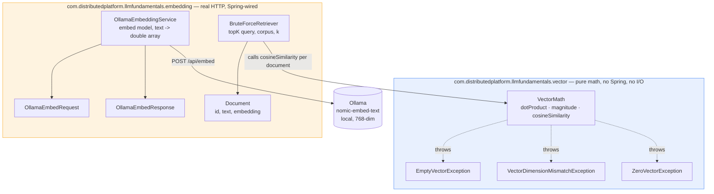
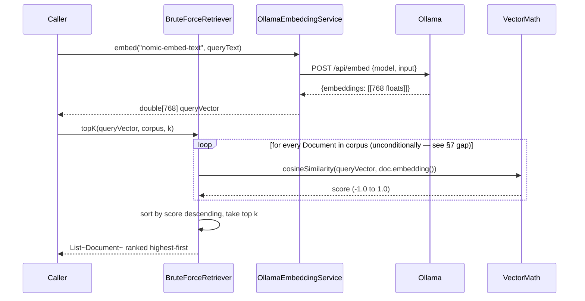

# Phase 7 Revision Guide — Vector and Retrieval Foundations

**Purpose of this document:** come back here after a day, a month, or a year with
zero memory of what was built, and leave understanding what Phase 7 is, why it
exists, what was actually built, and be able to test yourself against real interview
questions. Nothing here assumes you remember anything from the build process — that's
what `ROADMAP.md` is for, if you ever want the full argument trail.

---

## 1. The one-paragraph version

Phase 7 answers one question: **how do you teach a computer to find "similar"
content when there's no keyword overlap?** ("recursion" and "a function that calls
itself" mean the same thing but share no words.) The answer used everywhere in
production — search engines, chatbots grounded on your own documents (RAG),
recommendation systems — is: convert content into a vector of numbers ("an
embedding") such that similar meaning ends up as vectors pointing in a similar
direction, then measure that "similar direction" with **cosine similarity**. Phase 7
built that entire mechanism by hand, twice over: first the pure math (Milestone 7.1),
then a real embedding model plus real search over real sentences (Milestone 7.2) —
deliberately *before* touching any framework or real vector database, so the
mechanics are understood rather than assumed.

---

## 2. Why this matters (the production connection)

This is the retrieval half of **RAG (Retrieval-Augmented Generation)** — the
technique this project's Phase 8 will build for real. An LLM can't know your private
documents without expensive retraining. Instead: embed your documents once, store
the vectors, and at query time retrieve the most similar ones to hand the LLM as
context. Everything built in Phase 7 — cosine similarity, embedding a real model,
ranking a corpus — *is* that retrieval step, minus the scale problem (Phase 8 adds
`pgvector` and a real index for that).

---

## 3. Architecture — what exists now

Two packages inside the existing `llm-fundamentals` module. Note they're **packages,
not separate Gradle modules** — a deliberate choice (see §5) — `vector` is pure math
with zero I/O, `embedding` is real HTTP calls, kept as siblings rather than nesting
one inside the other.

### Runtime flow — what actually happens on a real query

---

## 4. Class-by-class reference

### `vector` package — Milestone 7.1

| Class | What it does | Link |
|---|---|---|
| `VectorMath` | Static utility: `dotProduct`, `magnitude`, `cosineSimilarity`, all hand-implemented | [source](../llm-fundamentals/src/main/java/com/distributedplatform/llmfundamentals/vector/VectorMath.java) |
| `EmptyVectorException` | Thrown when a vector has zero length (no dimensions at all) | [source](../llm-fundamentals/src/main/java/com/distributedplatform/llmfundamentals/vector/EmptyVectorException.java) |
| `VectorDimensionMismatchException` | Thrown when two vectors have different lengths | [source](../llm-fundamentals/src/main/java/com/distributedplatform/llmfundamentals/vector/VectorDimensionMismatchException.java) |
| `ZeroVectorException` | Thrown when cosine similarity would divide by a zero magnitude | [source](../llm-fundamentals/src/main/java/com/distributedplatform/llmfundamentals/vector/ZeroVectorException.java) |
| `VectorMathTest` | 17 pure unit tests — every exception, every precedence order, four canonical angles | [source](../llm-fundamentals/src/test/java/com/distributedplatform/llmfundamentals/vector/VectorMathTest.java) |

### `embedding` package — Milestone 7.2

| Class | What it does | Link |
|---|---|---|
| `Document` | Minimal record: `id`, `text`, `embedding` (double[]) | [source](../llm-fundamentals/src/main/java/com/distributedplatform/llmfundamentals/embedding/Document.java) |
| `OllamaEmbeddingService` | Real HTTP call to Ollama's `/api/embed`, two-constructor shape (mirrors `GeminiLlmClient`) | [source](../llm-fundamentals/src/main/java/com/distributedplatform/llmfundamentals/embedding/OllamaEmbeddingService.java) |
| `OllamaEmbedRequest` / `OllamaEmbedResponse` | Request/response DTOs matching Ollama's real, verified API shape | [request](../llm-fundamentals/src/main/java/com/distributedplatform/llmfundamentals/embedding/OllamaEmbedRequest.java) · [response](../llm-fundamentals/src/main/java/com/distributedplatform/llmfundamentals/embedding/OllamaEmbedResponse.java) |
| `BruteForceRetriever` | `topK(queryVector, corpus, k)` — linear scan, plain `List<Document>`, no index | [source](../llm-fundamentals/src/main/java/com/distributedplatform/llmfundamentals/embedding/BruteForceRetriever.java) |
| `OllamaEmbeddingServiceTest` | 1 real integration test + 2 mocked failure-path tests | [source](../llm-fundamentals/src/test/java/com/distributedplatform/llmfundamentals/embedding/OllamaEmbeddingServiceTest.java) |
| `BruteForceRetrieverTest` | 8 pure unit tests, hand-crafted vectors, no Ollama | [source](../llm-fundamentals/src/test/java/com/distributedplatform/llmfundamentals/embedding/BruteForceRetrieverTest.java) |
| `BruteForceRetrievalIntegrationTest` | Real end-to-end: 8 real sentences, real embeddings, real ranking | [source](../llm-fundamentals/src/test/java/com/distributedplatform/llmfundamentals/embedding/BruteForceRetrievalIntegrationTest.java) |

---

## 5. The decisions that mattered (condensed — full reasoning in `ADR-0008` and `ROADMAP.md`)

1. **Package, not module.** Both `vector` and `embedding` live inside `llm-fundamentals` as packages. A package costs nothing (no build file, no cross-module scanning); a module has real costs. No second real architectural boundary existed yet to justify a module — see [ADR-0006](../ADR/0006-shared-common-module.md) for the general bar this project uses for that call.
2. **Throw, don't return a sentinel, for a zero-magnitude vector.** Cosine similarity is *mathematically undefined* for a zero vector — not conventionally zero. Returning `0.0` would silently teach a false fact. See [ADR-0008](../ADR/0008-vector-math-error-representation.md).
3. **Three exception types, not one generic one.** `EmptyVectorException`, `VectorDimensionMismatchException`, `ZeroVectorException` each imply a different remediation path — collapsing them loses that signal.
4. **Plain `List<Document>`, not a `Map` or an interface "to swap for a vector DB later."** Brute-force search touches every entry regardless of container — a `Map`'s real strength (O(1) keyed lookup) is never exercised by this access pattern. Building an interface now, before a second real implementation exists, would repeat the exact premature-abstraction mistake this project's `common` module ADR already reasoned through once.

---

## 6. Real results actually measured (not fabricated — Rule 9)

- `nomic-embed-text` produces **768-dimension** vectors, empirically confirmed to normalize to **~unit magnitude** (`0.9999998`) — meaning for this model specifically, `dotProduct` and `cosineSimilarity` are numerically equivalent (though the deliberate decision was **not** to exploit that — see interview Q3 in [7.2](7.2.md)).
- Real embedding latency: **~27ms/sentence warm**, but **~1,788ms/sentence on a cold start** (Ollama had unloaded the model from memory). Both numbers matter — cold-start vs. steady-state latency is a real characteristic of locally-hosted model serving, not noise to average away.
- Real semantic proof: an 8-sentence corpus (4 distributed-systems, 4 baking) correctly and cleanly separated by real cosine similarity scores against a distributed-systems query — the first genuine end-to-end proof that the hand-built math and a real model compose correctly.

---

## 7. Known gaps — deliberately not fixed, tracked as real debt

- **A corpus with mixed embedding-model dimensionality fails the entire query, not just the stale row.** Because `Stream.sorted()` must consume its entire source before emitting anything, `.limit(k)` cannot short-circuit past a bad document anywhere in the corpus. Fail-fast (no silently-wrong ranking), but blunt (no document id in the exception, 100% query failure from one bad row). See `CLAUDE.md` → Known Existing Debt, and interview Q4 in [7.2](7.2.md) for the full trace.
- **No approximate nearest-neighbor index.** Brute force is `O(N)` per query — deliberately fine for a tiny corpus, deliberately *not* fine at production scale. Phase 8's `pgvector` is where this gets solved for real (HNSW/IVFFlat — see interview Q5 in [7.1](7.1.md)).
- **`magA == 0.0` uses exact floating-point equality**, not an epsilon threshold — an accepted simplification until a real embedding model ever produces a genuinely near-zero (not exactly zero) magnitude.

---

## 8. Test yourself

Full Q&A with corrections and accepted answers: [7.1](7.1.md) (6 questions) and
[7.2](7.2.md) (4 questions, the strongest interview performance in this project so
far). Try answering these cold before opening either file:

**From 7.1:**
1. What is cosine similarity measuring, and why divide out magnitude?
2. Trace exactly what happens for `cosineSimilarity({1.0, 2.0}, {})` — which exception, and why that one specifically?
3. How could a real (not hand-crafted) embedding produce a near-zero-but-not-exactly-zero magnitude, and what would the current code actually do?
4. If an embedding model always normalizes to unit length, what's the relationship between `dotProduct` and `cosineSimilarity`? Why might a production vector database exploit that?
5. Why does brute-force top-K search fail to scale, and what do real vector databases do instead — what's the trade-off?
6. Would your dimension check catch two different embedding models coincidentally producing the same vector length? Why or why not?

**From 7.2:**
1. What does a hand-crafted-vector unit test prove that a real-embedding integration test structurally cannot, and vice versa?
2. Why did the same embedding operation measure 14,308ms once and 217ms moments later — and why keep both numbers?
3. Given the measured embeddings are near-unit-length, should `BruteForceRetriever` use raw `dotProduct` instead of `cosineSimilarity` for the performance win? Why or why not?
4. Trace exactly what happens when `topK` runs against a corpus with mixed embedding-model dimensionality — crash or silent wrong answer? Which documents are affected?
