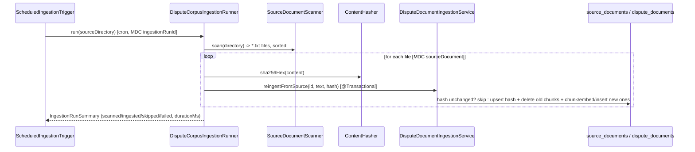

# Phase 8 Revision Guide — RAG

**Purpose of this document:** come back here after a day, a month, or a year with
zero memory of what was built, and leave understanding what Phase 8 is, why it
exists, what was actually built, and be able to test yourself against real interview
questions. Nothing here assumes you remember anything from the build process — that's
what `ROADMAP.md` is for, if you ever want the full argument trail.

**Status:** closed early, 2026-10-06, by deliberate decision — not every originally
planned task was finished. See §5 and `ROADMAP.md`'s Phase 8 closing note for what
was cut and why.

---

## 1. The one-paragraph version

Phase 8 built a real RAG (Retrieval-Augmented Generation) pipeline for
`dispute-service`: ingest real policy documents → chunk them → embed each chunk →
store in `pgvector` → at query time, embed a customer's dispute claim, retrieve the
most similar chunks, and ask an LLM to classify the claim under a chargeback reason
code using only that retrieved context. Phase 7 built the *mechanics* of embedding and
similarity by hand, in isolation; Phase 8 is where those mechanics became a real,
scheduled, production-shaped pipeline serving an actual downstream task — and where,
for the first time, this project measured whether a RAG design choice (which chunking
strategy) actually changes a real outcome, instead of just asserting that it would.

---

## 2. Why this matters (the production connection)

This is the textbook RAG pattern used everywhere an LLM needs to answer from private,
unindexed-at-training-time data: a support bot grounded on internal docs, a legal
assistant citing specific clauses, a classifier like this one applying real policy
text instead of the model's own possibly-wrong prior knowledge. Three things Phase 8
specifically forced that a toy RAG demo usually skips:

- **A real downstream task, not retrieval-in-the-abstract** (Milestone 8.4). "Did
  retrieval find the semantically closest paragraph" is a different question from
  "did the system classify the claim correctly" — a chunking or retrieval choice can
  win on the first metric and still not move the second at all. Phase 8 refused to
  compare strategies against anything but the real task.
- **Idempotent, failure-isolated, observable batch ingestion** (Milestone 8.3) — the
  actual production pattern for a corpus that changes on the order of days, not
  seconds, including the one bug this project found and fixed before it mattered: a
  hash-then-reingest ordering bug that would have silently and permanently mismarked
  a failed re-ingestion as successful.
- **Measuring instead of assuming a design choice helps** (Milestone 8.5) — chunking
  strategy is usually picked by convention or library default. This project built six
  real strategies and measured a real, explainable accuracy difference between them
  on its own data.

---

## 3. Architecture — what exists now

```mermaid
graph TD
    subgraph common["common.llm — shared, provider-agnostic (ADR-0011)"]
        LC[LlmClient «interface»]
        CM[ChatMessage]
        LR[LlmResponse]
    end

    subgraph chunking["dispute-service.chunking"]
        CS[ChunkingStrategy «interface»]
        BSC[BoundedSentenceChunker]
        FSC[FixedSizeChunker]
        PC[ParagraphChunker]
        RC[RecursiveChunker]
        OC[OverlapChunker]
        SC[SemanticChunker]
        BSC -.implements.-> CS
        FSC -.implements.-> CS
        PC -.implements.-> CS
        RC -.implements.-> CS
        OC -.implements.-> CS
        SC -.implements.-> CS
    end

    subgraph scheduling["dispute-service.scheduling — Milestone 8.3"]
        SIT[ScheduledIngestionTrigger<br/>@Scheduled cron]
        DCR[DisputeCorpusIngestionRunner]
        SDS[SourceDocumentScanner]
        CH[ContentHasher]
        SIT --> DCR
        DCR --> SDS
        DCR --> CH
    end

    subgraph service["dispute-service.service"]
        DIS[DisputeDocumentIngestionService]
        CCS[ClaimClassificationService]
        CCS -->|implements| LC2[uses LlmClient]
    end

    subgraph llm["dispute-service.llm — Milestone 8.4"]
        OLC[OllamaLlmClient]
        OLC -.implements.-> LC
    end

    subgraph dao["dispute-service.dao"]
        DDR[DisputeDocumentRepository]
        SDR[SourceDocumentRepository]
    end

    DCR --> DIS
    DIS -->|"@Qualifier boundedSentenceChunker, hardcoded"| BSC
    DIS --> DDR
    DIS --> SDR
    CCS --> DDR
    CCS --> OLC

    DDR -->|"ORDER BY embedding <=> query"| PG[("dispute-db<br/>pgvector, vector_cosine_ops<br/>no ANN index — ADR-0009")]
    OLC -->|"POST /api/chat, temperature 0"| OLLAMA_C[("Ollama · llama3.2")]

    style common fill:#e8f0fe,stroke:#4285f4
    style chunking fill:#e6f4ea,stroke:#1f7a6c
    style scheduling fill:#fef3e0,stroke:#f9a825
```

### Runtime flow — a real claim getting classified

```mermaid
sequenceDiagram
    participant Caller
    participant CCS as ClaimClassificationService
    participant Embed as OllamaEmbeddingService
    participant PG as pgvector (dispute_documents)
    participant LLM as OllamaLlmClient (temperature 0)

    Caller->>CCS: classify(claimText)
    CCS->>Embed: embed("nomic-embed-text", claimText)
    Embed-->>CCS: double[768]
    CCS->>PG: ORDER BY embedding <=> query LIMIT 3
    PG-->>CCS: top-3 retrieved chunk texts
    CCS->>CCS: build prompt — system: policy excerpts; user: claim
    CCS->>LLM: chat(messages)
    LLM-->>CCS: "REASON_CODE: ... EXPLANATION: ..."
    CCS->>CCS: parseResponse (with fallback for malformed output)
    CCS-->>Caller: ClassificationResult(reasonCode, explanation)
```

### The batch ingestion path (Milestone 8.3) — the other half of the pipeline



---

## 4. Class-by-class reference

### `common.llm` — moved here from `llm-fundamentals`, Milestone 8.4 (`ADR-0011`)

| Class | What it does | Link |
|---|---|---|
| `LlmClient` | `chat(List<ChatMessage>) -> LlmResponse` — the only thing shared across providers | [source](../common/src/main/java/com/distributedplatform/common/llm/LlmClient.java) |
| `ChatMessage` / `LlmResponse` | Provider-agnostic DTOs | [ChatMessage](../common/src/main/java/com/distributedplatform/common/llm/ChatMessage.java) · [LlmResponse](../common/src/main/java/com/distributedplatform/common/llm/LlmResponse.java) |

### `dispute-service` root + `dao` — Milestones 8.1–8.3

| Class | What it does | Link |
|---|---|---|
| `DisputeDocument` | `record(text, embedding, sourceDocumentId)` — the stored chunk | [source](../dispute-service/src/main/java/com/distributedplatform/disputeservice/DisputeDocument.java) |
| `SourceDocument` | `record(id, sourceIdentifier, contentHash, ingestedAt)` — the tracking row | [source](../dispute-service/src/main/java/com/distributedplatform/disputeservice/SourceDocument.java) |
| `DisputeDocumentRepository` | `save`, `deleteBySourceDocumentId`, `findNearest(queryVector, k)` (`embedding <=> query`) — raw `NamedParameterJdbcTemplate`, `ADR-0004` style | [source](../dispute-service/src/main/java/com/distributedplatform/disputeservice/dao/DisputeDocumentRepository.java) |
| `SourceDocumentRepository` | `findBySourceIdentifier`, `insert`, `updateHash` | [source](../dispute-service/src/main/java/com/distributedplatform/disputeservice/dao/SourceDocumentRepository.java) |
| `VectorLiterals` | `double[] -> pgvector` text literal conversion | [source](../dispute-service/src/main/java/com/distributedplatform/disputeservice/embedding/VectorLiterals.java) |
| `OllamaEmbeddingService` (+ DTOs) | Local, real `/api/embed` client — deliberately duplicated from `llm-fundamentals`, not shared (`ADR-0006`'s instance-count bar: two consumers wasn't enough) | [service](../dispute-service/src/main/java/com/distributedplatform/disputeservice/embedding/OllamaEmbeddingService.java) |

### `scheduling` — Milestone 8.3

| Class | What it does | Link |
|---|---|---|
| `SourceDocumentScanner` | Flat `*.txt` directory scan, sorted | [source](../dispute-service/src/main/java/com/distributedplatform/disputeservice/scheduling/SourceDocumentScanner.java) |
| `ContentHasher` | `sha256Hex(content)` for change detection | [source](../dispute-service/src/main/java/com/distributedplatform/disputeservice/scheduling/ContentHasher.java) |
| `DisputeCorpusIngestionRunner` | Orchestrates scan → per-file hash/ingest, MDC `ingestionRunId` correlation, per-file failure isolation | [source](../dispute-service/src/main/java/com/distributedplatform/disputeservice/scheduling/DisputeCorpusIngestionRunner.java) |
| `IngestionRunSummary` | `record(runId, scanned, ingested, skipped, failed, durationMs)` | [source](../dispute-service/src/main/java/com/distributedplatform/disputeservice/scheduling/IngestionRunSummary.java) |
| `ScheduledIngestionTrigger` | `@Scheduled(cron)` thin wrapper, defense-in-depth catch around the whole run | [source](../dispute-service/src/main/java/com/distributedplatform/disputeservice/scheduling/ScheduledIngestionTrigger.java) |

### `service` — Milestones 8.2 / 8.3 / 8.4

| Class | What it does | Link |
|---|---|---|
| `DisputeDocumentIngestionService` | `ingest(text)` (manual path) and `reingestFromSource(...)` (`@Transactional`, tracked path — the hash-upsert bug fix lives here) | [source](../dispute-service/src/main/java/com/distributedplatform/disputeservice/service/DisputeDocumentIngestionService.java) |
| `IngestionOutcome` | `record(ingested, chunkIds)` — fixed the `void`-return observability blind spot found in 8.3's review | [source](../dispute-service/src/main/java/com/distributedplatform/disputeservice/service/IngestionOutcome.java) |
| `ClaimClassificationService` | `classify(claimText)` — embed → retrieve top-3 → prompt → LLM → parse | [source](../dispute-service/src/main/java/com/distributedplatform/disputeservice/service/ClaimClassificationService.java) |
| `ClassificationResult` | `record(reasonCode, explanation)` | [source](../dispute-service/src/main/java/com/distributedplatform/disputeservice/service/ClassificationResult.java) |

### `llm` — Milestone 8.4

| Class | What it does | Link |
|---|---|---|
| `OllamaLlmClient` | Minimal, single-turn `LlmClient` implementation — no tool-calling, no `serializeMessages()` flattening bug exposure (Ollama takes a native messages array) | [source](../dispute-service/src/main/java/com/distributedplatform/disputeservice/llm/OllamaLlmClient.java) |
| `OllamaMessage` / `OllamaChatRequest` / `OllamaChatResponse` | Local wire-format DTOs, deliberately kept separate from the shared `ChatMessage` — found and fixed during review (`ADR-0011` addendum) | [OllamaMessage](../dispute-service/src/main/java/com/distributedplatform/disputeservice/llm/OllamaMessage.java) |

### `chunking` — Milestone 8.5

| Class | What it does | Link |
|---|---|---|
| `ChunkingStrategy` | `chunk(text) -> List<String>`, no call-time parameters by design | [source](../dispute-service/src/main/java/com/distributedplatform/disputeservice/chunking/ChunkingStrategy.java) |
| `BoundedSentenceChunker` | Sentence-boundary packing up to a size bound, hard-split fallback | [source](../dispute-service/src/main/java/com/distributedplatform/disputeservice/chunking/BoundedSentenceChunker.java) |
| `FixedSizeChunker` | Naive raw character cuts, zero boundary awareness (the baseline) | [source](../dispute-service/src/main/java/com/distributedplatform/disputeservice/chunking/FixedSizeChunker.java) |
| `ParagraphChunker` | One paragraph = one chunk, never packed with a neighbor | [source](../dispute-service/src/main/java/com/distributedplatform/disputeservice/chunking/ParagraphChunker.java) |
| `RecursiveChunker` | Cascades paragraph → sentence → word → raw character | [source](../dispute-service/src/main/java/com/distributedplatform/disputeservice/chunking/RecursiveChunker.java) |
| `OverlapChunker` | Sliding window, deliberately boundary-blind to isolate overlap as one variable | [source](../dispute-service/src/main/java/com/distributedplatform/disputeservice/chunking/OverlapChunker.java) |
| `SemanticChunker` | Embeds sentences, breaks at the Nth-percentile cosine-distance gap | [source](../dispute-service/src/main/java/com/distributedplatform/disputeservice/chunking/SemanticChunker.java) |
| `ZeroVectorException` | Found during review: mirrors `ADR-0008`'s zero-magnitude decision locally, instead of silently producing `NaN` | [source](../dispute-service/src/main/java/com/distributedplatform/disputeservice/chunking/ZeroVectorException.java) |

### The two eval harnesses, and what each one is actually for

| Class | What it does | Link |
|---|---|---|
| `DisputeClassificationEvalTest` (8.4) | One chunker (`boundedSentenceChunker`), one document — the first real, honest baseline | [source](../dispute-service/src/test/java/com/distributedplatform/disputeservice/service/DisputeClassificationEvalTest.java) |
| `ChunkingStrategyComparisonEvalTest` (8.5) | All six chunkers, two documents — the actual comparison, everything else held fixed | [source](../dispute-service/src/test/java/com/distributedplatform/disputeservice/service/ChunkingStrategyComparisonEvalTest.java) |

---

## 5. The decisions that mattered (condensed — full reasoning in the linked ADRs and `ROADMAP.md`)

1. **`vector_cosine_ops`, no ANN index yet** (`ADR-0009`). No measured need for an index at this corpus size; adding one speculatively would be solving a problem that doesn't exist yet.
2. **Scheduled batch, not Kafka, for ingestion** (`ADR-0010`). This corpus changes on the order of days/weeks; Kafka isn't scheduled to exist in this codebase yet, and pulling it forward would teach it shallowly, before its own dedicated phase. A real bug was found and fixed during this design: the hash-upsert had to move *inside* the same `@Transactional` boundary as the chunk delete/insert, or a failed re-ingestion could get permanently, silently mismarked as successful.
3. **`LlmClient` moves to `common`; concrete implementations don't** (`ADR-0011`). The first justification offered — "a real need, unlike the embedding-client duplication" — didn't survive scrutiny: counted the same way `ADR-0006` counts instances, both cases are exactly two consumers. The actual distinguishing factor is **complexity/risk of what's duplicated**, not consumer count: a 30-line HTTP client with no known bugs is cheap to duplicate; a settled interface with two implementations and a named, tracked, unresolved bug (`GeminiLlmClient.serializeMessages()`) is not. A related, separately-found issue: `dispute-service`'s own `OllamaLlmClient` must map `ChatMessage` to its own local `OllamaMessage` wire type rather than serializing the shared DTO directly — a structural guarantee that a future provider's needs can never silently reach another provider's wire format, not just a smaller diff.
4. **`ChunkingStrategy` earns an interface; `BoundedSentenceChunker` and `BruteForceRetriever` (Phase 7) didn't.** The actual bar, from Milestone 8.1's own Q4: a **real, simultaneous** multi-implementation need with **one real shared caller** — not "might need more later." Six chunkers, one harness, same milestone, satisfies it; the earlier two cases didn't.
5. **Phase 8 closed early, 2026-10-06 — deliberate, not silent.** Retrieval-strategy comparison (dense/BM25/hybrid/reranking/HyDE) and the Spring AI closing milestone were both in the original plan and were cut after real fatigue was named honestly, two weeks in. What Phase 8 was actually *for* — understanding why chunking/retrieval design matters, and real practice designing, implementing, and empirically evaluating RAG components — was already delivered by Milestone 8.5.

---

## 6. Real results actually measured (not fabricated — Rule 9)

- **Milestone 8.4 baseline:** 6/6 (100%) on the golden dataset's six clean, unambiguous claims, using `boundedSentenceChunker` alone. The two ambiguous claims were genuinely informative *because* they were scored separately rather than blended in: claim-08's explanation cited the retrieved policy's own disqualifying-pattern language almost verbatim (real evidence retrieval was doing work, not decoration); claim-07 picked an acceptable answer but never surfaced the real 13.1-vs-13.3 tension the golden set's own note said a good classifier should name.
- **Milestone 8.5 comparison:** `paragraph` and `recursive` both scored 6/6 (100%); `boundedSentenceChunker`, `fixedSize`, `overlap`, and `semantic` all scored 5/6 (83%), each missing the same claim. Traced to a verified mechanism, not left as a bare number: at today's shared `maxChunkSize=1000`, `boundedSentenceChunker`'s real first chunk on the fraud document is exactly 975 characters — the document's title merged with the *entire* 10.4 fraud paragraph, with no room for anything else. `paragraph`/`recursive` keep the title and the fraud paragraph as two separate chunks (14 chunks total across both documents, exactly matching the real paragraph count). The generic title text dilutes the fraud chunk's embedding just enough to rank it slightly below the undiluted version for a clean fraud claim. (The first draft of this explanation guessed the fraud paragraph was being mixed with the *other* policy paragraph instead — corrected after replaying the real chunking logic against the actual document. See `interviews/8.5.md`.)
- **Corpus-adequacy finding, independently confirmed twice:** the original single 3-paragraph, 10-sentence test document was empirically proven too small to let `ParagraphChunker` or `SemanticChunker` demonstrate their real behavior at a realistic bound — every real paragraph exceeded 300 characters, and the default `breakpointPercentile=0.95` had too few samples (fewer than ~21 sentences) to land below the distribution's own maximum. Fixed by authoring and directly measuring a second document.

---

## 7. Known gaps — deliberately not fixed, tracked as real debt

- **`DisputeClassificationEvalTest`/`ChunkingStrategyComparisonEvalTest`'s match logic is a substring check** (`result.reasonCode().contains(code)`), not exact equality — safe only because none of the three real reason codes is a substring of another, verified directly (`"13.10".contains("13.1")` is `true`). Recorded, not fixed, by deliberate choice. See `CLAUDE.md`.
- **No ANN index, no concurrency guard between overlapping ingestion runs, no cleanup for a removed source file** — all named and deferred in Milestone 8.3's own scoping, not oversights.
- **`maxChunkSize=1000` (and every other chunking knob) is still "not yet measured, a placeholder"** everywhere in this codebase — Milestone 8.5's whole result is a function of that one shared, unmeasured constant, not a universal ranking of chunking strategies.
- **Retrieval-strategy comparison and the Spring AI closing milestone were never built.** Explicitly cut, not silently dropped — see §5 and `ROADMAP.md`'s Phase 8 closing note. Revisit only if a later phase creates a concrete need for either.
- **Milestone 8.2 has no closing interview.** A real process gap, named honestly rather than backfilled after the fact — see `ROADMAP.md`.

---

## 8. Test yourself

Full Q&A with corrections and accepted answers: [8.1](8.1.md) (5 questions),
[8.3](8.3.md) (5 questions — the strongest interview in this project at the time),
[8.4](8.4.md) (4 questions), and [8.5](8.5.md) (2 questions, deliberately shortened —
see that file's own note on why). Milestone 8.2 has no interview file; that gap is
real, not an omission from this guide. Try answering these cold before opening any of
them:

**From 8.1:**
1. What does declaring `embedding` as `vector(768)` in the schema give you that a runtime check in Java application code cannot — and what does it deliberately *not* give you?
2. With no index, trace what actually happens, mechanically, when `ORDER BY embedding <=> query` runs.
3. Why is `vector_ip_ops` the *riskier* choice for this corpus specifically, even though it's mathematically equivalent to cosine for normalized vectors and cheaper to compute?
4. What's the actual bar for when a repository class earns its place, and why hadn't Milestone 8.1 crossed it yet?
5. If a future HTTP endpoint synchronously embedded and inserted a document within one request, what would actually go wrong under real load — name more than one distinct failure mechanism.

**From 8.3:**
1. `reingestFromSource` used to return `void`. What specific, real operational blind spot did that create?
2. Trace exactly why the hash upsert has to live inside the same `@Transactional` method as the chunk delete/insert, not as a separate call just before it.
3. Why can't `CorrelationIdFilter`'s `correlationId` MDC key be reused for this job's run ID?
4. You kept the FK at `RESTRICT` instead of `CASCADE`. What does a future "delete a source document" feature have to do differently under each option, and why is forcing the extra step actually valuable?
5. A chunker bug causes every file in a scheduled run to fail. What does an operator watching logs see — and what's the real risk if nobody's watching?

**From 8.4:**
1. Why does classification specifically need `temperature: 0.0`?
2. Why does blending clean and ambiguous golden-set claims into one accuracy percentage manufacture false precision?
3. What's the general, transferable principle for when to share an abstraction versus duplicate it — beyond this one `LlmClient` decision?
4. Trace exactly what would, and would not, need to change if `dispute-service` switched its classification LLM call from Ollama to Gemini.

**From 8.5:**
1. Why did `paragraph`/`recursive` outperform the other four strategies on claim-01 — trace the real, verified mechanism, not a guess.
2. Why did `ChunkingStrategy` earn an interface this time, when `BoundedSentenceChunker` and `BruteForceRetriever` didn't earlier — state the actual bar, not just "multiple implementations exist."
